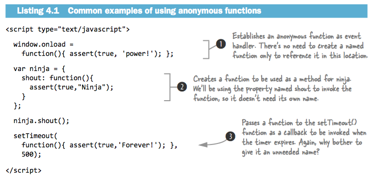

###Chapter 3
p47  
###Scopes  


4 ways to invoke a function:   
■ As a function, in which the function is invoked in a straightforward manner   
■ As a method, which ties the invocation to an object, enabling object-oriented programming   
■ As a constructor, in which a new object is brought into being   
■ Via its apply() or call() methods, which is kind of complicated, so we’ll cover that when we get to it  

####From arguments to function parameters
p.48 
#####If more arguments are supplied than there are parameters, the “excess” argu- ments are simply not assigned to parameter names.   
````
 function whatever(a,b,c) { ... }
````
If we were to call it with ````whatever(1,2,3,4,5)````, the arguments, 1, 2, and 3 would be assigned to a, b, and c, respectively. Arguments 4 and 5 are unassigned to any parameters.  
  
#####If there are more parameters than there are arguments, the parameters that have no corresponding argument are set to undefined.   
if we were to call the ````whatever(a,b,c)```` function with ````whatever(1)````, parameter a would be assigned the value 1, and b and c would be set to undefined.  

####This and Argument  
all function invocations are also passed two implicit parame- ters: **arguments** and **this**.  

#####Arguments parameter  
The arguments parameter is a collection of all of the arguments passed to the function.  
The collection has a property named **length** that contains the count of arguments, 
and the individual argument values can be obtained using array indexing notation;
**arguments[2]** would fetch the third parameter, for example.  

**But arguments it is not an array!!!!**   

#####This parameter
Whenever a function is invoked, in addition to the parameters that represent the explicit arguments that were provided on the function call,  
an implicit parameter named **this** is also passed to the function.   
   
The this parameter refers to an object that’s implicitly associated with the function invocation and is termed the **function context**.  

What the **this** parameter points to isn’t, as in Java, defined by how the function is declared, but by **how it’s invoked.**   


p.49 
####Invocation as a function
This type of invocation occurs when a function is invoked using the () operator, and the expression to which the () operator is applied doesn’t reference the function as a property of an object. (In that case, we’d have a method invocation, but we’ll dis- cuss that next.)   

````
function ninja(){};
ninja();
var samurai = function(){};
samurai();
````

As it turns out, this concept of invoking “a function as a function” is really a special case of the next invocation type we’ll talk about: invoking “as a method.”   

####Invocation as a method
When a function is assigned to a property of an object and the invocation occurs by referencing the function using that property, then the function is invoked as a **method** of that object.  

```` 
var o = {};
o.whatever = function(){};
o.whatever();
````

When we invoke the function as the method of an object, that object becomes the function context and is available within the function via the **this** parameter.   
This is one of the primary means by which JavaScript allows object-oriented code to be written.   


Contrast this with invocation “as a function,” in which the function is defined on the window and called without the need to use a reference to window.
Except for being able to leave off the implicit window reference, it’s the same thing.
The function “belongs” to window, and window is set as the function context, in the same way that object o is the function context in the above example.
Even though these mechanisms look different, they’re really the same.   

   

Note that even though the same function is used throughout all these examples, the function context for each invocation of the function changes depending upon **how the function is invoked**,
 rather than on how it was declared.   

####Invocation as a function
There’s nothing special about a function that’s going to be used as a constructor; 
constructor functions are declared just like any other functions. 
The difference is in how the function is invoked.   

**To invoke the function as a constructor, we precede the function invocation with the new keyword.**

p.52  
#####The superpowers of constructors  
When a constructor is onvoked: 

- A new empty object is created.  
- This object is passed to the constructor as the this parameter, and thus becomes the constructor’s function context.  
- In the absence of any explicit return value, the new object is returned as the constructor’s value.  

   

#####Coding considerations for constructors  
**Functions and methods** are generally named starting with a verb that describes what they do **(skulk(), creep(), sneak(), doSomethingWonderful(), and so on)** and start with a lowercase letter.   
**Constructors**, on the other hand, are usually named as a noun that describes the object that’s being constructed and start with an uppercase character; **Ninja(), Samurai(), Ronin(), KungFuPanda()**, and so on.  

p.52  
#####Invocation with the apply() and call() methods  
JavaScript provides a means for us to invoke a function and to explicitly specify any object we want as the function context. We do this through the use of one of two methods that exist for every function: **apply() and call()**.  

To invoke a function using its apply() method, we pass two parameters to apply():  
- the object to be used as the function context,   
- and an array of values to be used as the invocation arguments.  

The call() method is used in a similar manner, except that the arguments are passed directly in the argument list rather than as an array.  

   

p.57
Let’s consider a concrete example of forcing the function context to be an object of our own choosing. Let’s take a simple function that will perform an operation on every entry of an array.  

   

Our iteration function sports a simple signature that expects the array of objects to be iterated over as the first argument and a callback function as the second (1). The function iterates over the array entries, invoking the callback function (2) for each entry.  
We use the call() method of the callback function, passing the current iteration entry as the first parameter and the loop index as the second. This should cause the current entry to become the function context and the index to be passed as the single parameter to the callback.  
We set up a simple array (3) and then call the forEach() function, passing the test array and a callback within which we test that the expected entry is set as the function context for each invocation of the callback (4). Figure 3.10 (not showed in this sumary)  shows that our function works splendidly.   

###Chapter 4. Wielding functions

####Anonymous functions
Anonymous functions are typically used in cases where we wish to create a function for later use, such as storing it in a variable, establishing it as a method of an object, or using it as a callback (for example, as a timeout or event handler). In all of these situ- ations, the function doesn’t need to have a name for later reference.    

   

#####Recursion in named functions 
There are any number of common examples for recursive functions. One is the test for a palindrome, this is perhaps the “Hello world!” for recursive techniques.  

By using a more mathematical definition of a palindrome, we can come up with a more elegant solution. Here’s the definition:  
- A single or zero-character string is a palindrome.   
- Any other string is a palindrome if the first and last characters are the same, and the string that remains, excepting those characters, is a palindrome.  

````
function isPalindrome(text) {
  if (text.length <= 1) return true;
  if (text.charAt(0) != text.charAt(text.length - 1)) return false;
  return isPalindrome(text.substr(1,text.length - 2));
}
````

Another example

````
function chirp(n) {
    return n > 1 ? chirp(n - 1) + "-chirp" : "chirp";
}
assert(chirp(3) == "chirp-chirp-chirp",
        "Calling the named function comes naturally.");
````

The function above satisfies two criteria for recursion: 
- a reference to self, and   
- convergence towards termination.  

The function clearly calls itself, so the first criterion is satisfied. And because the value of parameter n decreases with each iteration, it will sooner or later reach a value of one or less and stop the recursion, satisfying the second criterion.   

Note that a **“recursive”** function that **doesn’t** converge toward termination is better known as an **infinite loop!**  

#####Recursion with methods
In the previous section, we said that we were going to give our ninja the ability to chirp, but we really didn’t. What we created was a standalone function for chirping.   
Let’s fix that by declaring the recursive function as a method of a ninja object.   
This complicates things a bit, because the recursive function becomes an anonymous func- tion assigned to an object’s property, as you can see in the next listing.  

````
var ninja = {
  chirp: function(n) {
	return n > 1 ? ninja.chirp(n - 1) + "-chirp" : "chirp";
  } 
};
assert(ninja.chirp(3) == "chirp-chirp-chirp",
         "An object property isn't too confusing, either.");
````

In this test, we defined our recursive function as an anonymous function referenced by the chirp property of the ninja object.  
Within the function, we invoke the function recursively via a reference to the object’s property: ninja.chirp().  
We can’t reference it directly by its name as we did in listing 4.2, because it doesn’t have one.  


p.67
#####The pilfered reference problem   

````
var ninja = {
    chirp: function(n) {
      return n > 1 ? ninja.chirp(n - 1) + "-chirp" : "chirp";
    }
  };
  var samurai = { chirp: ninja.chirp };
ninja = {};
try {
    assert(samurai.chirp(3) == "chirp-chirp-chirp",
          "Is this going to work?");
} catch(e){
    assert(false,
           "Uh, this isn't good! Where'd ninja.chirp go?");
}
````

The above test do not pass!.  

A diagram of the relationships created is shown in figure 4.3    

  

We can rectify this problem by fixing the initially sloppy definition of the recursive function. Rather than explicitly referencing ninja in the anonymous function, we should have used the function context (this) as follows:     

```` 
var ninja = {
  chirp: function(n) {
    return n > 1 ? this.chirp(n - 1) + "-chirp" : "chirp";
  }
};
````

#####Inline named functions
Let’s consider another approach: what if we give the anonymous function a name?   
No longer anonymous, these functions are better called **inline functions**, rather than **“anonymous named functions”** to avoid the oxymoron.  

  

Verifying the identity of an inline function:

````
// Declares a named inline function and assigns it to variable.
var ninja = function myNinja(){
	// Tests that two names are equivalent inside the inline function
	assert(ninja == myNinja, "This function is named two things at once!");
};

ninja(); // Invokes the function to perform the internal test.

// Tests that the inline function’s name isn’t available outside the inline function.
assert(typeof myNinja == "undefined",
         "But myNinja isn't defined outside of the function.");
````

This code brings up the most important point regarding inline functions:  
**even though inline functions can be named, those names are only visible within the functions themselves.**    

Inline function names act somewhat like variable names, and their scope is limited to the function within which they’re declared.   

p.71  
####Fun with functions as objects 

````
var obj = {};
         var fn = function(){};
         assert(obj && fn, "Both the object and function exist.");
````

Just as we can assign an object to a variable, we can do so with a function. This also applies to assigning functions to object properties in order to create methods.  

Another capability that may have surprised you is that, just as with any other object, we can attach properties to a function:
```` 
var obj = {};
var fn = function(){};
obj.prop = "hitsuke (distraction)";
fn.prop = "tanuki (climbing)";
````

#####Storing functions 
There are times when we may want to store a collection of related but unique functions.  
We can make use of function properties to achieve this with an appropriate level of sophistication, as shown in in the next listing.  


Within add(), we first check to see if an id property has been added to the function, and if so, we assume that the function has already been processed and we ignore it.  
Otherwise, we assign an id property to the function (incrementing the nextId property along the way) and add the function as a property of the cache, using the id value as the property name.  

**TIP** The **!!** construct is a simple way of turning any JavaScript expression into its Boolean equivalent. For example: ```` !!"he shot me down" === true ```` and ````!!0 === false````.  
In listing 4.8 we end up converting a function into its Boolean equivalent, which will always be true. (Sure we could have hardcoded true, but then we wouldn’t have had a chance to introduce !!).  

#####Self-memoizing functions  
iMemoization (no, that’s not a typo) is the process of building a function that’s capable of remembering its previously computed values.  


This approach has two major advantages:  
- The end user enjoys performance benefits for function calls asking for a previously computed value.  
- It happens completely seamlessly and behind the scenes; neither the end user nor the page author need to perform any special requests or do any extra initialization in order to make it all work.  

But it’s not all roses and violins; there are disadvantages that may need to be weighed against the advantages:   
- Any sort of caching will certainly sacrifice memory in favor of performance.  
- Purists may consider that caching is a concern that should not be mixed with the business logic; a function or method should do one thing and do it well.  
- It’s difficult to load-test or measure the performance of an algorithm such as this one.  

Another example momoizing DOM elements:  

````

function getElements(name) {
  if (!getElements.cache) getElements.cache = {};
  return getElements.cache[name] =
    getElements.cache[name] ||
    document.getElementsByTagName(name);
}
````

iThe memoization (caching) code is quite simple and doesn’t add that much extra complexity to the overall querying process. But if we do some performance analysis upon the function, we’ll find that this simple layer of caching yields us a 5x performance increase, as shown in table 4.1. Not a bad superpower to have.   

  

#####Faking array methods

  
In this example, we’re creating a “normal” object and instrumenting it to mimic some of the behaviors of an array.  
First, we define a length property to record the number of element that are stored (1), just like an array.    
Then we define a method to add an ele- ment to the end of our simulated array, calling this method simply add() (2).   

Rather than write our own code, we’ve decided to leverage a native method of JavaScrip arrays: ````Array.prototype.push````.   

Normally, the Array.prototype.push() method would operate on its own array via its function context.  
But here, we’re tricking the method to use our object as its context by using the call() method and forcing our object to be the context of the push() method.  
The push() method, which increments the length property (thinking that it’s the length property of an array), adds a numbered property to the object referencing the passed element.   

p.77
####Variable-length argument lists  
#####Using apply() to supply variable arguments 

   

In this code we define two functions: one to find the smallest value within an array (1), and one to find the largest value (2).  
Notice how both functions use the apply() method to supply the value in the passed arrays as variable-length argument lists to the Math functions.  
Also note that we specify the context as being the Math object.  
This isn’t necessary (the min() and max() methods will continue to work regardless of what’s passed in as the context), but there’s no reason not to be tidy in this situation.  

#####Function overloading
All functions are implicitly passed this important parameter, which gives our functions the power to handle any number of passed arguments. Even if we only define a certain number of parameters, we’ll always be able to access all passed arguments through the arguments parameter.   

**DETECTING AND TRAVERSING ARGUMENTS**  
In other, more pure, object-oriented languages, method overloading is usually effected by declaring distinct implementations of methods of the same name but with differing parameter lists.  
That’s not how it’s done in JavaScript. In JavaScript, we **“overload”** functions with a single implementation that modifies its behavior by inspecting the number and nature of the passed arguments.   

In the following code, we’re going to merge the properties of multiple objects into a single root object. This can be an essential utility for effecting inheritance   

````
function merge(root){
    for (var i = 1; i < arguments.length; i++) {
	for (var key in arguments[i]) {
      		root[key] = arguments[i][key];
	} 
     }
     return root;
}
var merged = merge(
  {name: "Batou"},
  {city: "Niihama"});

assert(merged.name == "Batou",
         "The original name is intact.");
assert(merged.city == "Niihama",
         "And the city has been copied over.");
````
The first thing that you’ll notice about the implementation of the merge() function (1) is that its signature only declares a single parameter: root.    
This doesn’t mean that we’re limited to calling the function with a single parameter. Far from it! We can, in fact, call merge() with any number of parameters, including none.  

Remember that what we’re trying to do is to merge the properties of any object passed as the second through nth arguments into the object passed as root (the first argument). So we iterate through the arguments in the list, starting at index 1 in order to skip the first argument.  

**TIP** To check whether an argument that corresponds to a named parameter was passed, we can use the expression ````paramname === undefined````, which will evaluate to **true** if there’s no corresponding argument.   
**TIP** If you haven’t seen a for-in statement before, it simply iterates through all the properties of an object, setting the property name (key) as the iteration item.   

**SLICING AND DICING AN ARGUMENTS LIST**   

For our next example, we’ll build a function that multiplies the first argument with the largest of the remaining arguments.  
This probably isn’t something that’s particularly applicable in our applications, but it is an example of yet more techniques for dealing with arguments within a function.  

````
 function multiMax(multi){
    return multi * Math.max.apply(Math,
      Array.prototype.slice.call(arguments, 1));
}
  assert(multiMax(3, 1, 2, 3) == 9,
         "3*3=9 (First arg, by largest.)");
````
Fools the slice() method into working on the arguments list, which you may recall isn’t an instance of Array.   

**FUNCTION OVERLOADING APPROACHES**  
When it comes to function overloading—the technique of defining a function that does different things based upon what’s passed to it—it’s easy to imagine that such a function could be easily implemented by using the mechanisms we’ve learned so far to inspect the argument list, and to perform different actions in if-then and else-if clauses. Often, that approach will serve us well, especially if the actions to be taken are on the simpler side.  
But once things start getting a bit more complicated, lengthy functions using many such clauses can quickly become unwieldy. In the remainder of this section, we’re going to explore a technique by which we can create multiple functions—seemingly with the same name, but each differentiated from the others by the number of arguments they expect—that can be written as distinct and separate anonymous functions rather than as a monolithic if-then-else-if block.  
All of this hinges on a little-known property of functions that we need to learn about first.  

**THE FUNCTION’S LENGTH PROPERTY**  
There’s an interesting property on all functions that isn’t very well known, but that gives us an insight into how the function was declared: the length property.    
This property, **not to be confused** with the **length** property of the **arguments parameter**, equates to the number of named parameters with which the function was declared.  

````
function makeNinja(name){}
function makeSamurai(name, rank){}
assert(makeNinja.length == 1, "Only expecting a single argument");
assert(makeSamurai.length == 2, "Two arguments expected");
````

As a result, within a function, we can determine two things about its arguments:  
- How many named parameters it was declared with, via the **length property**  
- How many arguments were passed on the invocation, via **arguments.length**  

**OVERLOADING FUNCTIONS BY ARGUMENT COUNT**  
Suppose we want to have a method on an object that performs different operations based upon argument count.  
If we want to have long, monolithic functions, we could do something like the following:  

````
var ninja = {
  whatever: function() {
       switch (arguments.length) {
         case 0:
           /* do something */
           break;
         case 1:
           /* do something else */
           break;
         case 2:
           /* do yet something else */
           break;
       //and so on ...
      }
  }
}
````

In this approach, each case would perform a different operation based upon the argument count, obtaining the actual arguments through the arguments parameter. But that’s not very tidy, and certainly not very ninja, is it?   
Let’s posit another approach. What if we wanted to add the overloaded method using syntax along the following lines:   

````
var ninja = {};
addMethod(ninja,'whatever',function(){ /* do something */ }); 
addMethod(ninja,'whatever',function(a){ /* do something else */ }); 
addMethod(ninja,'whatever',function(a,b){ /* yet something else */ });
````

But the addMethod() function doesn’t exist, so we’ll need to create it ourselves.  


Our addMethod() function accepts three arguments:
- An object upon which a method is to be bound  
- The name of the property to which the method will be bound  
- The declaration of the method to be bound  

There’s a bit of sleight of hand going on here with regard to how the inner anonymous function accesses old and fn, and it involves a concept called closures, which we’ll take a close look at in the next chapter.  
For now, just accept that when it executes, the inner function has access to the current values of old and fn.  


We declare and bind three versions of a find() method:
- One expecting no arguments that returns all ninjas (2)  
- One that expects a single argument and that returns any ninjas whose name starts with the passed text (3)  
- One that expects two arguments and that returns any ninjas whose first and last names match the passed strings (4)  

This technique is especially nifty because these bound functions aren’t actually stored in any typical data structure. Rather, they’re all saved as **references within closures**.  

It should be noted that there are some caveats to be aware of when using this particular technique:  
- The overloading only works for different numbers of arguments; it doesn’t differentiate based on type, argument name, or anything else. Which is frequently exactly what we’ll want to do.  
- Such overloaded methods will have some function call overhead. We’ll want to take that into consideration in high-performance situations.  

p.86  
####Checking for functions 
````
function ninja(){}
assert(typeof ninja == "function",
      "Functions have a type of function");
````

This should be the typical way that we check if a value is a function, and this will always work if what we’re testing is indeed a function. But there are a few cases where this test may yield some false-positives that we need to be aware of:

- Firefox—Doing a typeof on the HTML <object> element yields an inaccurate “function” result, instead of “object” as we might expect.  
- Internet Explorer—When attempting to find the type of a function that was part of another window (such as an iframe) that no longer exists, its type will be reported as “unknown.”  
- Safari—Safari considers a DOM NodeList to be a function. So typeof docu- ment.body.childNodes == "function".  

One technique that does work fairly well is to convert the function to a string and determine its type based upon its serialized value, as in the following code:  
````
function isFunction(fn) {
return Object.prototype.toString.call(fn) === "[object Function]";
}
````

p.89 
###Chapter 5. Closing in on closures

####How closures work
Succinctly put, a **closure** is the scope created when a function is declared that allows the function to access and manipulate variables that are external to that function.  
Put another way, **closures** allow a function to access all the variables, as well as other functions, that are in scope when the function itself is declared.  

````
var outerValue = 'ninja'; // (1)
function outerFunction() { //(2)
    assert(outerValue == "ninja","I can see the ninja.");
}
outerFunction(); //(3)
````
In this code example, we declare a variable (1) and a function (2) in the same scope— in this case, the global scope. Afterwards, we cause the function to execute (3).  

Not impressed? I guess that’s not surprising. Because both the outer value and the outer function are declared in global scope, that scope (which is actually a closure) never goes away (as long as the page is loaded), and it’s not surprising that the function can access the variable because it’s still in scope and viable. Even though the closure exists, its benefits aren’t yet clear.  

Let’s spice it up a little in the next listing.  


Let’s over-analyze the code in innerFunction() and see if we predict what might happen. The first assert is certain to pass: outerValue is in the global scope and is visible to everything.   
But what about the second?
We’re executing the inner function after the outer function has been executed via the trick of copying a reference to the function to a global reference (later).   
When the inner function executes, the scope inside the outer function is long gone and not visible at the point at which we’re invoking the function through later.  
So we could very well expect the assert to fail, as innerValue is sure to be undefined. Right?  
But when we run the test, all of them pass.   


When we declared innerFunction() inside the outer function, not only was the function declaration defined, but a closure was also created that encompasses not only the function declaration, but also all variables that are in scope **at the point of the declaration**.  

When innerFunction() eventually executes, even if it’s executed after the scope in which it was declared goes away, it has access to the original scope in which it was declared through its closure, as shown in Figure 5.3.   
That’s what closures are all about. They create a **“safety bubble,”** if you will, of the function and the variables that are in scope at the point of the function’s declaration, so that the function has all it will need to execute.  
This **“bubble,”** containing the function and its variables, stays around as long as the function itself does.  

Let’s augment that example with a few additions to observe a few more core principles of closures.   


We added a parameter (1) to the inner function, and we pass a value to the function when it’s invoked through later (5).  
We also added a variable that’s declared after the outer function declaration (4).  
When the tests inside (2) and outside (3) the inner function execute, we can see all tests pass.  

This shows three more interesting concepts regarding closures:  
- Function parameters are included in the closure of that function. (Seems obvious, but now we’ve said it for sure.)  
- All variables in an outer scope, even those declared after the function declaration, are included.   
- Within the same scope, variables not yet defined cannot be forward-referenced.  

####Putting closures to work

#####Private variables 
A common use of closures is to encapsulate some information as a **“private variable”** of sorts—in other words, to limit the scope of such variables.  
Object-oriented code written in JavaScript is unable to use traditional private variables: properties of the object that are hidden from outside parties.  
But by using the concept of a closure, we can achieve an acceptable approximation, as demonstrated by the following code.   


We create a function that is to serve as a constructor (1). Recall that when using the **new** keyword on a function (5), a new object instance is created and the function is called, with that new object as its context, to serve as a constructor to that object. 
So **this** within the function is a newly instantiated object.  

Within the constructor, we define a variable to hold state, feints (2). The JavaScript scoping rules for this variable limit its accessibility to within the constructor.  
To give access to the value of the variable from code that’s outside the scope, we define an **accessor** method (3), ````getFeints()````, which can be used to read, but not write to, the private variable.   
**(Accessor methods are frequently called “getters.”)***

An implementation method,````feint()````, is then created to give us control over the value of the variable in a controlled fashion (4).   

After the constructor has been established, we invoke it with the new operator (5) and then call the ````feint()```` method (6).  

This situation is depicted in figure 5.5.   


#####Callbacks and timers


**TIP** Using the $ sign as a suffix or prefix is a jQuery convention to indicate that the variable holds a jQuery object reference.  


By defining the variables inside the function, and by relying upon the closures to make them available to the timer callback invocations, each animation gets its own private “bubble” of variables, as shown in figure 5.7.  

There’s another important concept that this example makes clear.   
Not only do we see the values that these variables had at the time the closure was created, but we can also update them within the closure while the function within the closure executes.   
In other words, the closure isn’t simply a snapshot of the state of the scope at the time of creation, but an active encapsulation of that state that can be modified as long as the closure exists.    


p.100 
####Binding function contexts
Consider the following code, in which a function that serves as an object method is bound to a DOM element as an event listener.   


When we load the example into a browser and click the button, we see that something is amiss; the test has failed.  
Recalling the lessons of chapter 3, if we had called the function via  ````button.click()```` the context **would** indeed have been the button.   
But in our example, the event-handling system of the browser defines the context of the invocation to be the target element of the event, which causes the context to be the <button> element, not the button object.    
So we set our click state on the wrong object!   

Take a look at the following code, which updates the code of listing 5.7 with additions (in bold) to bend the function context to our wills.  


This particular implementation of a binding function makes the assumption that we’re going to be using an existing method of an object (a function attached as a property), and that we want that object to be the context.    
With that assumption,````bind()```` only needs two pieces of information: a reference to the object containing the method, and the name of the method.   


This ````bind()```` function is a simplified version of a function popularized by the Prototype JavaScript library, which promotes writing code in a clean and classical object-oriented manner.  
The original Prototype version of the method looks something like the following code:   

````
// Adds the bind() method to all functions via its prototype. That’s something we’ll see in the next chapter.  
Function.prototype.bind = function(){
  var fn = this, args = Array.prototype.slice.call(arguments),
    object = args.shift();
  return function(){
    return fn.apply(object,
	args.concat(Array.prototype.slice.call(arguments)));
  };
};
var myObject = {};
function myFunction(){
  return this == myObject;
}
assert( !myFunction(), "Context is not set yet" );
var aFunction = myFunction.bind(myObject);
assert( aFunction(), "Context is set properly" );
````

This method is quite similar to the function we implemented in listing 5.8, but with a couple of notable additions.   
To start, it attaches itself to all functions, rather than presenting itself as a globally accessible function by adding itself as a property of the prototype of JavaScript’s Function.   

p.103 
####Partially applying functions
“Partially applying” a function is a particularly interesting technique in which we can prefill arguments to a function before it’s even executed. In effect, partially applying a function returns a new function with predefined arguments, which we can later call.  

This sort of proxy function **—one that stands in for another function and calls that function when executed—**.  
This technique of filling in the first few arguments of a function (and returning a new function) is typically called **currying.**  

Let’s say that we wanted to split a CSV (comma-separated value) string into its com- ponent parts, ignoring extraneous whitespace.   

Listing 5.10 Partially applying arguments to a native function:   
```` 
String.prototype.csv = String.prototype.split.partial(/,\s*/); // (1)

var results = ("Mugan, Jin, Fuu").csv(); // (2) 

// (3)
assert(results[0]=="Mugan" &&  
       results[1]=="Jin" &&
       results[2]=="Fuu",
       "The text values were split properly");
````

In listing 5.10 we’ve taken the String’s ````split()```` method and have imagined a ````partial()```` method (yet to be implemented, but we’ll take care of that in listing 5.12) that we can use to prefill the regular expression upon which to split (1).   
The result is a new function named ````csv()```` that we can call at any point to convert a list of comma-separated values (2) into an array without having to deal with messy regular expressions.  

With all that in mind, let’s look at how a partial/curry method is (more or less) implemented in the Prototype library, as seen in the next listing.  


Listing 5.11 An example of a curry function (filling in the first specified arguments)
````
Function.prototype.curry = function() {
  // Remembers the function and “prefill” arguments in variables that will be captured in the closure (1) 
  var fn = this,
      args = Array.prototype.slice.call(arguments);

  // Creates the anonymous curried function  (2)
  return function() {
    return fn.apply(this, args.concat(
      Array.prototype.slice.call(arguments)));
  }; 
};
````

This technique is another good example of using a closure to remember state.  
In this case, we want to remember the function that we’re augmenting (the **this** parameter is never included in any closure, because each function invocation has its own version of **this**) and the arguments to be prefilled B and transfer them to the newly constructed function (2). 

This new function will have the filled-in arguments and the new arguments concatenated together and passed.   

While this style of partial function application is perfectly useful, we can do better. What if we wanted to fill in any missing argument from a given function, not just those at the beginning of the argument list?  

Listing 5.12 A more complex “partial” function
````
Function.prototype.partial = function() {
  var fn = this, args = Array.prototype.slice.call(arguments);
  return function() {
    var arg = 0;
    for (var i = 0; i < args.length && arg < arguments.length; i++) {
      if (args[i] === undefined) {
        args[i] = arguments[arg++];
} }
    return fn.apply(this, args);
  };
};
````

This implementation is fundamentally similar to Prototype’s curry() method, but it has a couple of important differences.   
Notably, the user can specify arguments anywhere in the parameter list that will be filled in later by specifying the undefined value for “missing” arguments.   
To accommodate this, we’ve increased the abilities of our argument-merging technique.   
Effectively, we loop through the arguments that are passed in and look for the appropriate gaps (the undefined values), filling in the missing pieces as we go along.  

Thinking back to the example of constructing a string-splitting function, let’s look at some other ways in which this new functionality could be used. To start, we could construct a function that has the ability to be easily delayed:

````
var delay = setTimeout.partial(undefined, 10);

delay(function(){
  assert(true,
	"A call to this function will be delayed 10 ms.");
  });
````

This snippet creates a new function, named delay(), into which we can pass another function that will be called asynchronously after 10 milliseconds.   

We could also create a simple function for binding events:  
```` 
var bindClick = document.body.addEventListener
  .partial("click", undefined, false);

bindClick(function(){
  assert(true, "Click event bound via curried function.");
});
````

This technique could be used to construct simple helper methods for event-binding in a library. The result would be a simpler API where the end user wouldn’t be inconve- nienced by unnecessary function arguments, reducing them to a simpler function call.   

p.106 
####Overriding function behavior 
#####Momoization 

( I jumped this section in order to get summarize others part that are more important to me right now )

p.109 
#####Function wrapping
Function wrapping is a technique for encapsulating the logic of a function while overwriting it with new or extended functionality in a single step.  
It’s best used when we wish to override some previous behavior of a function, while still allowing certain use cases to execute.   

A common use is when implementing pieces of cross-browser code in situations where a deficiency in a browser must be accounted for. Consider, for example, working around a bug in Opera’s implementation of accessing title attributes. 
In the Prototype library, the function-wrapping technique is employed to work around this bug.  


####Inmediate functions
```` (function(){})() ````

First, let’s ignore the contents of the first set of parentheses, and examine the construct:  
````(...)()````

We know that we can call any function using the ````functionName()```` syntax, but in place of the function name we can use any expression that references a function instance.   
That’s why we can call a function referenced by a variable that refers to the function using the variable name, like this:    

````
var someFunction = function(){ ... };
result = someFunction();
````

As with other expressions, if we want an operator—in this case, the function call operator ()—to be applied to an entire expression, we’d enclose that expression in a set of parentheses.    
Consider how the expressions ````(3 + 4) * 5 ````and ````3 + (4 * 5)```` differ from each other.   

That means that in ````(...)()````, the first set of parentheses is merely a set of delimiters enclosing an expression, whereas the second set is an operator.   
It’d be perfectly legal to change our example to the following, in which the expression that references the function is enclosed in parentheses:   

````
var someFunction = function(){ ... }; 
result = (someFunction)();
````

It’s just a bit confusing that each set of parentheses has a very different meaning. If the function call operator were something like || rather than (), the expression (...)|| would likely be less confusing.

Now, rather than the variable name, if we directly provided the anonymous func- tion (omitting any function body for the moment for brevity) within the first set of parentheses, we’d end up with this syntax:   
(**function(){...}**)();

The result of this code is an expression that does all of the following in a single statement:  
- Creates a function instance  
- Executes the function  
- Discards the function (as there are no longer any references to it after the statement has ended)  

#####Temporary scope and private variables

Using immediate functions, we can start to build up interesting enclosures for our work. Because the function is executed immediately, and, as with all functions, all the variables inside of it are confined to its inner scope, we can use it to create a temporary scope, within which our state can be contained.  

**CREATING A SELF-CONTAINED SCOPE**   
````
(function(){
  var numClicks = 0;
  document.addEventListener("click", function(){
    alert( ++numClicks );
  }, false);
})();
````

Because the immediate function is executed immediately (hence its name), the click handler is also bound right away. The important thing to note is that a closure is created for the handler that includes numClicks, allowing the numClicks variable to persist along with the handler, and be referenceable by the handler **but nowhere else**.   

But it’s important to remember that because immediate functions are functions, they can be used in interesting ways, like this:  
````
document.addEventListener("click", (function(){
  var numClicks = 0;
  return function(){
    alert( ++numClicks );
  };
})(), false);
````

This technique involves a very different way of looking at scope. In many languages, you can scope things based upon the block they’re in. In JavaScript, variables are scoped based upon the closure they’re in.  

**ENFORCING NAMES IN A SCOPE VIA PARAMETERS**  


**KEEPING CODE READABLE WITH SHORTER NAMES**   

Often, we’ll have a fragment of code that makes frequent references to an object. If the reference is long and involved, all those repeated references to the long name can make the code difficult to read.    

The sophisticated functional programmer can use an immediate function to introduce the short name into a limited scope. Here’s a quick example of doing just that from the Prototype JavaScript library:   

```` 
(function(v) {
  Object.extend(v, {
             href:
             src:
             type:
             action:
             disabled:    v._flag,
             checked:     v._flag,
             readonly:    v._flag,
             multiple:    v._flag,
             onload:      v._getEv,
             onunload:    v._getEv,
             onclick:     v._getEv,
             ...
           });
})(Element.attributeTranslations.read.values);
````

#####Loops 

The next code is broke: 
````

  <div>DIV 0</div>
  <div>DIV 1</div>
  <script type="text/javascript">
	var divs = document.getElementsByTagName("div");
    	for (var i = 0; i < divs.length; i++) {
      		divs[i].addEventListener("click", function() {
			alert("divs #" + i + " was clicked.");
      		}, false);
	}
</script>
````
It will always alert the last value stored in i; in this case, 2.

The solution (another closure): 
````
<div>DIV 0</div>
<div>DIV 1</div>
<script type="text/javascript">
  var div = document.getElementsByTagName("div");
	for (var i = 0; i < div.length; i++) (function(n){ div[n].addEventListener("click", function(){
      		alert("div #" + n + " was clicked.");
    		}, false);
	})(i);
</script>
`````

#####Library wrapping

````

          (function(){
           var jQuery = window.jQuery = function(){
             // Initialize
           };
// ... })();

````
Note that there’s a double assignment performed, completely intentionally. First, the jQuery constructor (as an anonymous function) is assigned to window.jQuery, which introduces it as a global variable.   
But that doesn’t guarantee that it will stay that way; it’s completely within the realms of possibility that code outside our control may change or remove the variable. To avoid that problem, we assign it to a local variable, jQuery, to enforce it as such with the scope of the immediate function.   

Another way to do the same:   

````
var jQuery = (function(){
  function jQuery(){
    // Initialize
  }
  // ...
  return jQuery;
})();
````
p.119
###Chapter 6. Object-orientation with prototypes 

####Instantiation and prototypes
All functions have a prototype property that initially references an empty object. This property doesn’t serve much purpose until the function is used as a constructor. We saw in chapter 3 that using the new keyword to invoke a function calls the function as a constructor with a newly instantiated and empty object as its context.    

#####Object instantiation  

The simplest way to create a new object:  
````
var o = {};
````
This creates a new and empty object, which we can then populate with properties via assignment statements:    
````
var o = {};
o.name = 'Saito';
o.occupation = 'marksman';
o.cyberizationLevel = 20;
````
But those coming from an object-oriented background might miss the encapsulation and structuring that comes with the concept of a class constructor: a function that serves to initialize the object to a known initial state.   

JavaScript provides such a mechanism, though in a very different form than most other languages.   
Like object-oriented languages such as Java and C++, JavaScript employs the new operator to instantiate new objects via constructors, but there’s no class definition in JavaScript.    
Rather, the new operator, applied to a constructor function (as we observed in chapters 3 and 4), triggers the creation of a newly allocated object.    

**PROTOTYPES AS OBJECT BLUEPRINTS**  

Let’s examine a simple case of using a function, both with and without the new operator, and see how the prototype property provides properties for the new instance. Consider the following code.   


**INSTANCE PROPERTIES**  
When the function is called as a constructor via the new operator, its context is defined as the new object instance. This means that in addition to attaching properties via the prototype, we can initialize values within the constructor function via the this parameter.   
Let’s examine the creation of such instance properties in the next listing.


When we run the test d by loading the page into the browser, we see that the test passes! This shows that instance members created inside a constructor will occlude properties of the same name defined in the prototype.  
The precedence of the initialization operations is important and goes as follows:  
- Properties are bound to the object instance from the prototype.  
- Properties are added to the object instance within the constructor function.  


A simplified overview of the process is as follows:   
- When a property reference to an object is made, the object itself is checked to see if the property exists. If it does, the value is taken. If not ...  
- The prototype associated with the object is located, and it is checked for the property. If it exists, the value is taken. If not ...  
- The value is undefined.  


#####Object typing via constructors 


In listing 6.5 we define a constructor and create an object instance using it.   
Then we examine the type of the instance using the typeof operator (1). This isn’t very revealing, as all instances will be objects, thus always returning "object" as the result.   
Much more interesting is the instanceof operator (2), which is really helpful in that it gives us a clear way to determine whether an instance was created by a particular function constructor.  

On top of this, we can also make use of the constructor property, that we now know is added to all instances, as a reference back to the original function that created it.  
We can use this to verify the origin of the instance (much like how we can with the instanceof operator).

Listing 6.6 Instantiating a new object using a reference to a constructor   
````
function Ninja(){}
  var ninja = new Ninja();
  var ninja2 = new ninja.constructor();
  assert(ninja2 instanceof Ninja, "It's a Ninja!");
  assert(ninja !== ninja2, "But not the same Ninja!");
````

#####Inheritance and the prototype chain

There’s an additional feature of the instanceof operator that we can use to our advantage to utilize a form of object inheritance. But in order to make use of it, we need to understand how inheritance works in JavaScript and what role the prototype chain plays.   

````
function Person(){}
  Person.prototype.dance = function(){};
function Ninja(){} Ninja.prototype = new Person();

var ninja = new Ninja();
assert(ninja instanceof Ninja,"ninja receives functionality from the Ninja prototype");
assert(ninja instanceof Person, "... and the Person prototype");
assert(ninja instanceof Object, "... and the Object prototype");
assert(typeof ninja.dance == "function", "... and can dance!")
````

An additional happy side effect of doing prototype inheritance in this manner is that all inherited function prototypes will continue to live-update. The manner in which the prototype chain is applied for our example is shown in figure 6.8.   


The following listing shows a possible implementation of forEach() that we could use to fill the gap in older browsers.

Listing 6.9 A future-proof JavaScript 1.6 forEach() method implementation    
````
if (!Array.prototype.forEach) {
	Array.prototype.forEach = function(callback, context) {
      	  for (var i = 0; i < this.length; i++) {
            callback.call(context || null, this[i], i, this);
      	  } 
	};
}

["a", "b", "c"].forEach(function(value, index, array) { assert(value,
		"Is in position " + index + " out of " +
		(array.length - 1));
		}
);
````

Listing 6.10 Adding a new method to all HTML elements via the HTMLElement prototype.   

````
<div id="parent">
  <div id="a">I`m going to be removed.</div>
  <div id="b">Me too!</div>
</div>
<script type="text/javascript">
  HTMLElement.prototype.remove = function() {
    if (this.parentNode)
      this.parentNode.removeChild(this);
  };
  var a = document.getElementById("a");
  a.parentNode.removeChild(a);
  document.getElementById("b").remove();
  assert(!document.getElementById("a"),"a is gone.");
  assert(!document.getElementById("b"),"b is gone too.");
</script>
````

####The gotchas!
#####Extending Object  

```` 
<script type="text/javascript">
  Object.prototype.keys = function() {
    var keys = [];
    for (var p in this) keys.push(p);
    return keys;
};
  var obj = { a: 1, b: 2, c: 3 };
  assert(obj.keys().length == 3,
        "There are three properties in this object.");
</script>
````

What went wrong, of course, is that in adding the keys() method to Object, we introduced another property that will appear on all objects and that is included in the count.  
This affects all objects and will force any code to have to account for the extra property.   
This could break code that’s based upon perfectly reasonable assumptions made by page authors. This is obviously unacceptable. Don’t do it!   

JavaScript provides a method called **hasOwnProperty()**, which can be used to determine whether properties are actually defined on an object instance versus imported from a prototype.  

Listing 6.12 Using the hasOwnProperty() method to tame Object prototype extensions  
````
<script type="text/javascript">
  Object.prototype.keys = function() {
    var keys = [];
    for (var i in this)
       if (this.hasOwnProperty(i)) keys.push(i); // (1) 
    return keys;
};
  var obj = { a: 1, b: 2, c: 3 };
  assert(obj.keys().length == 3,
         "There are three properties in this object.");
</script>
````
Ignores prototyped properties by using ````hasOwnProperty()```` to skip over properties from the (1) prototype
Our redefined method ignores non-instance properties (1) so that this time the test succeeds.   

#####Extending Number  


But when we try to load the page into a browser, the page won’t even load, as shown in figure 6.10. It turns out that the syntax parser can’t handle the literal case.    

#####Subclassing native objects

 skipped

#####Instantiation issues 

 skipped ...but just a few recalls

Recall a few important concepts:
- We can get a reference to the currently executing function via arguments.callee (we learned this in chapter 4).  
- The context of a “regular” function is the global scope (unless someone did something to make it not so).  
- The instanceof operator for a constructed object tests for its constructor. Using these facts, we can see that the expression, this instanceof arguments.callee will evaluate to true when executed within a constructor, but false when executed within a regular function.   

p.143 
####Writing class-like code 


