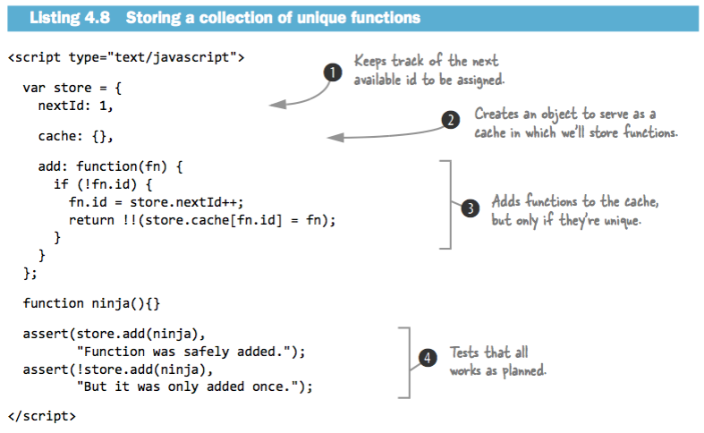

###Chapter 3
p47  
###Scopes  


4 ways to invoke a function:   
■ As a function, in which the function is invoked in a straightforward manner   
■ As a method, which ties the invocation to an object, enabling object-oriented programming   
■ As a constructor, in which a new object is brought into being   
■ Via its apply() or call() methods, which is kind of complicated, so we’ll cover that when we get to it  

####From arguments to function parameters
p.48 
#####If more arguments are supplied than there are parameters, the “excess” argu- ments are simply not assigned to parameter names.   
````
 function whatever(a,b,c) { ... }
````
If we were to call it with ````whatever(1,2,3,4,5)````, the arguments, 1, 2, and 3 would be assigned to a, b, and c, respectively. Arguments 4 and 5 are unassigned to any parameters.  
  
#####If there are more parameters than there are arguments, the parameters that have no corresponding argument are set to undefined.   
if we were to call the ````whatever(a,b,c)```` function with ````whatever(1)````, parameter a would be assigned the value 1, and b and c would be set to undefined.  

####This and Argument  
all function invocations are also passed two implicit parame- ters: **arguments** and **this**.  

#####Arguments parameter  
The arguments parameter is a collection of all of the arguments passed to the function.  
The collection has a property named **length** that contains the count of arguments, 
and the individual argument values can be obtained using array indexing notation;
**arguments[2]** would fetch the third parameter, for example.  

**But arguments it is not an array!!!!**   

#####This parameter
Whenever a function is invoked, in addition to the parameters that represent the explicit arguments that were provided on the function call,  
an implicit parameter named **this** is also passed to the function.   
   
The this parameter refers to an object that’s implicitly associated with the function invocation and is termed the **function context**.  

What the **this** parameter points to isn’t, as in Java, defined by how the function is declared, but by **how it’s invoked.**   


p.49 
####Invocation as a function
This type of invocation occurs when a function is invoked using the () operator, and the expression to which the () operator is applied doesn’t reference the function as a property of an object. (In that case, we’d have a method invocation, but we’ll dis- cuss that next.)   

````
function ninja(){};
ninja();
var samurai = function(){};
samurai();
````

As it turns out, this concept of invoking “a function as a function” is really a special case of the next invocation type we’ll talk about: invoking “as a method.”   

####Invocation as a method
When a function is assigned to a property of an object and the invocation occurs by referencing the function using that property, then the function is invoked as a **method** of that object.  

```` 
var o = {};
o.whatever = function(){};
o.whatever();
````

When we invoke the function as the method of an object, that object becomes the function context and is available within the function via the **this** parameter.   
This is one of the primary means by which JavaScript allows object-oriented code to be written.   


Contrast this with invocation “as a function,” in which the function is defined on the window and called without the need to use a reference to window.
Except for being able to leave off the implicit window reference, it’s the same thing.
The function “belongs” to window, and window is set as the function context, in the same way that object o is the function context in the above example.
Even though these mechanisms look different, they’re really the same.   

   

Note that even though the same function is used throughout all these examples, the function context for each invocation of the function changes depending upon **how the function is invoked**,
 rather than on how it was declared.   

####Invocation as a function
There’s nothing special about a function that’s going to be used as a constructor; 
constructor functions are declared just like any other functions. 
The difference is in how the function is invoked.   

**To invoke the function as a constructor, we precede the function invocation with the new keyword.**

p.52  
#####The superpowers of constructors  
When a constructor is onvoked: 

- A new empty object is created.  
- This object is passed to the constructor as the this parameter, and thus becomes the constructor’s function context.  
- In the absence of any explicit return value, the new object is returned as the constructor’s value.  

   

#####Coding considerations for constructors  
**Functions and methods** are generally named starting with a verb that describes what they do **(skulk(), creep(), sneak(), doSomethingWonderful(), and so on)** and start with a lowercase letter.   
**Constructors**, on the other hand, are usually named as a noun that describes the object that’s being constructed and start with an uppercase character; **Ninja(), Samurai(), Ronin(), KungFuPanda()**, and so on.  

p.52  
#####Invocation with the apply() and call() methods  
JavaScript provides a means for us to invoke a function and to explicitly specify any object we want as the function context. We do this through the use of one of two methods that exist for every function: **apply() and call()**.  

To invoke a function using its apply() method, we pass two parameters to apply():  
- the object to be used as the function context,   
- and an array of values to be used as the invocation arguments.  

The call() method is used in a similar manner, except that the arguments are passed directly in the argument list rather than as an array.  

   

p.57
Let’s consider a concrete example of forcing the function context to be an object of our own choosing. Let’s take a simple function that will perform an operation on every entry of an array.  

   

Our iteration function sports a simple signature that expects the array of objects to be iterated over as the first argument and a callback function as the second (1). The function iterates over the array entries, invoking the callback function (2) for each entry.  
We use the call() method of the callback function, passing the current iteration entry as the first parameter and the loop index as the second. This should cause the current entry to become the function context and the index to be passed as the single parameter to the callback.  
We set up a simple array (3) and then call the forEach() function, passing the test array and a callback within which we test that the expected entry is set as the function context for each invocation of the callback (4). Figure 3.10 (not showed in this sumary)  shows that our function works splendidly.   

###Chapter 4. Wielding functions

####Anonymous functions
Anonymous functions are typically used in cases where we wish to create a function for later use, such as storing it in a variable, establishing it as a method of an object, or using it as a callback (for example, as a timeout or event handler). In all of these situ- ations, the function doesn’t need to have a name for later reference.    

   

#####Recursion in named functions 
There are any number of common examples for recursive functions. One is the test for a palindrome, this is perhaps the “Hello world!” for recursive techniques.  

By using a more mathematical definition of a palindrome, we can come up with a more elegant solution. Here’s the definition:  
- A single or zero-character string is a palindrome.   
- Any other string is a palindrome if the first and last characters are the same, and the string that remains, excepting those characters, is a palindrome.  

````
function isPalindrome(text) {
  if (text.length <= 1) return true;
  if (text.charAt(0) != text.charAt(text.length - 1)) return false;
  return isPalindrome(text.substr(1,text.length - 2));
}
````

Another example

````
function chirp(n) {
    return n > 1 ? chirp(n - 1) + "-chirp" : "chirp";
}
assert(chirp(3) == "chirp-chirp-chirp",
        "Calling the named function comes naturally.");
````

The function above satisfies two criteria for recursion: 
- a reference to self, and   
- convergence towards termination.  

The function clearly calls itself, so the first criterion is satisfied. And because the value of parameter n decreases with each iteration, it will sooner or later reach a value of one or less and stop the recursion, satisfying the second criterion.   

Note that a **“recursive”** function that **doesn’t** converge toward termination is better known as an **infinite loop!**  

#####Recursion with methods
In the previous section, we said that we were going to give our ninja the ability to chirp, but we really didn’t. What we created was a standalone function for chirping.   
Let’s fix that by declaring the recursive function as a method of a ninja object.   
This complicates things a bit, because the recursive function becomes an anonymous func- tion assigned to an object’s property, as you can see in the next listing.  

````
var ninja = {
  chirp: function(n) {
	return n > 1 ? ninja.chirp(n - 1) + "-chirp" : "chirp";
  } 
};
assert(ninja.chirp(3) == "chirp-chirp-chirp",
         "An object property isn't too confusing, either.");
````

In this test, we defined our recursive function as an anonymous function referenced by the chirp property of the ninja object.  
Within the function, we invoke the function recursively via a reference to the object’s property: ninja.chirp().  
We can’t reference it directly by its name as we did in listing 4.2, because it doesn’t have one.  


p.67
#####The pilfered reference problem   

````
var ninja = {
    chirp: function(n) {
      return n > 1 ? ninja.chirp(n - 1) + "-chirp" : "chirp";
    }
  };
  var samurai = { chirp: ninja.chirp };
ninja = {};
try {
    assert(samurai.chirp(3) == "chirp-chirp-chirp",
          "Is this going to work?");
} catch(e){
    assert(false,
           "Uh, this isn't good! Where'd ninja.chirp go?");
}
````

The above test do not pass!.  

A diagram of the relationships created is shown in figure 4.3    

  

We can rectify this problem by fixing the initially sloppy definition of the recursive function. Rather than explicitly referencing ninja in the anonymous function, we should have used the function context (this) as follows:     

```` 
var ninja = {
  chirp: function(n) {
    return n > 1 ? this.chirp(n - 1) + "-chirp" : "chirp";
  }
};
````

#####Inline named functions
Let’s consider another approach: what if we give the anonymous function a name?   
No longer anonymous, these functions are better called **inline functions**, rather than **“anonymous named functions”** to avoid the oxymoron.  

  

Verifying the identity of an inline function:

````
// Declares a named inline function and assigns it to variable.
var ninja = function myNinja(){
	// Tests that two names are equivalent inside the inline function
	assert(ninja == myNinja, "This function is named two things at once!");
};

ninja(); // Invokes the function to perform the internal test.

// Tests that the inline function’s name isn’t available outside the inline function.
assert(typeof myNinja == "undefined",
         "But myNinja isn't defined outside of the function.");
````

This code brings up the most important point regarding inline functions:  
**even though inline functions can be named, those names are only visible within the functions themselves.**    

Inline function names act somewhat like variable names, and their scope is limited to the function within which they’re declared.   

p.71  
####Fun with functions as objects 

````
var obj = {};
         var fn = function(){};
         assert(obj && fn, "Both the object and function exist.");
````

Just as we can assign an object to a variable, we can do so with a function. This also applies to assigning functions to object properties in order to create methods.  

Another capability that may have surprised you is that, just as with any other object, we can attach properties to a function:
```` 
var obj = {};
var fn = function(){};
obj.prop = "hitsuke (distraction)";
fn.prop = "tanuki (climbing)";
````

#####Storing functions 
There are times when we may want to store a collection of related but unique functions.  
We can make use of function properties to achieve this with an appropriate level of sophistication, as shown in in the next listing.  



Within add(), we first check to see if an id property has been added to the function, and if so, we assume that the function has already been processed and we ignore it.  
Otherwise, we assign an id property to the function (incrementing the nextId property along the way) and add the function as a property of the cache, using the id value as the property name.  

**TIP** The **!!** construct is a simple way of turning any JavaScript expression into its Boolean equivalent. For example: ```` !!"he shot me down" === true ```` and ````!!0 === false````.  
In listing 4.8 we end up converting a function into its Boolean equivalent, which will always be true. (Sure we could have hardcoded true, but then we wouldn’t have had a chance to introduce !!).  

#####Self-memoizing functions  
iMemoization (no, that’s not a typo) is the process of building a function that’s capable of remembering its previously computed values.  


This approach has two major advantages:  
- The end user enjoys performance benefits for function calls asking for a previously computed value.  
- It happens completely seamlessly and behind the scenes; neither the end user nor the page author need to perform any special requests or do any extra initialization in order to make it all work.  

But it’s not all roses and violins; there are disadvantages that may need to be weighed against the advantages:   
- Any sort of caching will certainly sacrifice memory in favor of performance.  
- Purists may consider that caching is a concern that should not be mixed with the business logic; a function or method should do one thing and do it well.  
- It’s difficult to load-test or measure the performance of an algorithm such as this one.  

Another example momoizing DOM elements:  

````

function getElements(name) {
  if (!getElements.cache) getElements.cache = {};
  return getElements.cache[name] =
    getElements.cache[name] ||
    document.getElementsByTagName(name);
}
````

iThe memoization (caching) code is quite simple and doesn’t add that much extra complexity to the overall querying process. But if we do some performance analysis upon the function, we’ll find that this simple layer of caching yields us a 5x performance increase, as shown in table 4.1. Not a bad superpower to have.   

  

#####Faking array methods

  
In this example, we’re creating a “normal” object and instrumenting it to mimic some of the behaviors of an array.  
First, we define a length property to record the number of element that are stored (1), just like an array.    
Then we define a method to add an ele- ment to the end of our simulated array, calling this method simply add() (2).   

Rather than write our own code, we’ve decided to leverage a native method of JavaScrip arrays: ````Array.prototype.push````.   

Normally, the Array.prototype.push() method would operate on its own array via its function context.  
But here, we’re tricking the method to use our object as its context by using the call() method and forcing our object to be the context of the push() method.  
The push() method, which increments the length property (thinking that it’s the length property of an array), adds a numbered property to the object referencing the passed element.   

p.77
####Variable-length argument lists  
#####Using apply() to supply variable arguments 

   

In this code we define two functions: one to find the smallest value within an array (1), and one to find the largest value (2).  
Notice how both functions use the apply() method to supply the value in the passed arrays as variable-length argument lists to the Math functions.  
Also note that we specify the context as being the Math object.  
This isn’t necessary (the min() and max() methods will continue to work regardless of what’s passed in as the context), but there’s no reason not to be tidy in this situation.  

#####Function overloading
All functions are implicitly passed this important parameter, which gives our functions the power to handle any number of passed arguments. Even if we only define a certain number of parameters, we’ll always be able to access all passed arguments through the arguments parameter.   

**DETECTING AND TRAVERSING ARGUMENTS**
In other, more pure, object-oriented languages, method overloading is usually effected by declaring distinct implementations of methods of the same name but with differing parameter lists.  
That’s not how it’s done in JavaScript. In JavaScript, we **“overload”** functions with a single implementation that modifies its behavior by inspecting the number and nature of the passed arguments.   

In the following code, we’re going to merge the properties of multiple objects into a single root object. This can be an essential utility for effecting inheritance   

````
function merge(root){
    for (var i = 1; i < arguments.length; i++) {
	for (var key in arguments[i]) {
      		root[key] = arguments[i][key];
	} 
     }
     return root;
}
var merged = merge(
  {name: "Batou"},
  {city: "Niihama"});

assert(merged.name == "Batou",
         "The original name is intact.");
assert(merged.city == "Niihama",
         "And the city has been copied over.");
````
The first thing that you’ll notice about the implementation of the merge() function (1) is that its signature only declares a single parameter: root.    
This doesn’t mean that we’re limited to calling the function with a single parameter. Far from it! We can, in fact, call merge() with any number of parameters, including none.  

Remember that what we’re trying to do is to merge the properties of any object passed as the second through nth arguments into the object passed as root (the first argument). So we iterate through the arguments in the list, starting at index 1 in order to skip the first argument.  

**TIP** To check whether an argument that corresponds to a named parameter was passed, we can use the expression ````paramname === undefined````, which will evaluate to **true** if there’s no corresponding argument.   
**TIP** If you haven’t seen a for-in statement before, it simply iterates through all the properties of an object, setting the property name (key) as the iteration item.   

**SLICING AND DICING AN ARGUMENTS LIST**   

For our next example, we’ll build a function that multiplies the first argument with the largest of the remaining arguments.  
This probably isn’t something that’s particularly applicable in our applications, but it is an example of yet more techniques for dealing with arguments within a function.  

````
 function multiMax(multi){
    return multi * Math.max.apply(Math,
      Array.prototype.slice.call(arguments, 1));
}
  assert(multiMax(3, 1, 2, 3) == 9,
         "3*3=9 (First arg, by largest.)");
````
Fools the slice() method into working on the arguments list, which you may recall isn’t an instance of Array.   

**FUNCTION OVERLOADING APPROACHES**  
When it comes to function overloading—the technique of defining a function that does different things based upon what’s passed to it—it’s easy to imagine that such a function could be easily implemented by using the mechanisms we’ve learned so far to inspect the argument list, and to perform different actions in if-then and else-if clauses. Often, that approach will serve us well, especially if the actions to be taken are on the simpler side.  
But once things start getting a bit more complicated, lengthy functions using many such clauses can quickly become unwieldy. In the remainder of this section, we’re going to explore a technique by which we can create multiple functions—seemingly with the same name, but each differentiated from the others by the number of arguments they expect—that can be written as distinct and separate anonymous functions rather than as a monolithic if-then-else-if block.  
All of this hinges on a little-known property of functions that we need to learn about first.  

**THE FUNCTION’S LENGTH PROPERTY**  
There’s an interesting property on all functions that isn’t very well known, but that gives us an insight into how the function was declared: the length property.    
This property, **not to be confused** with the **length** property of the **arguments parameter**, equates to the number of named parameters with which the function was declared.  

````
function makeNinja(name){}
function makeSamurai(name, rank){}
assert(makeNinja.length == 1, "Only expecting a single argument");
assert(makeSamurai.length == 2, "Two arguments expected");
````

As a result, within a function, we can determine two things about its arguments:  
- How many named parameters it was declared with, via the **length property**  
- How many arguments were passed on the invocation, via **arguments.length**  

**OVERLOADING FUNCTIONS BY ARGUMENT COUNT**  
Suppose we want to have a method on an object that performs different operations based upon argument count.  
If we want to have long, monolithic functions, we could do something like the following:  

````
var ninja = {
  whatever: function() {
       switch (arguments.length) {
         case 0:
           /* do something */
           break;
         case 1:
           /* do something else */
           break;
         case 2:
           /* do yet something else */
           break;
       //and so on ...
      }
  }
}
````

In this approach, each case would perform a different operation based upon the argument count, obtaining the actual arguments through the arguments parameter. But that’s not very tidy, and certainly not very ninja, is it?   
Let’s posit another approach. What if we wanted to add the overloaded method using syntax along the following lines:   

````
var ninja = {};
addMethod(ninja,'whatever',function(){ /* do something */ }); 
addMethod(ninja,'whatever',function(a){ /* do something else */ }); 
addMethod(ninja,'whatever',function(a,b){ /* yet something else */ });
````

But the addMethod() function doesn’t exist, so we’ll need to create it ourselves.  


Our addMethod() function accepts three arguments:
- An object upon which a method is to be bound  
- The name of the property to which the method will be bound  
- The declaration of the method to be bound  

There’s a bit of sleight of hand going on here with regard to how the inner anonymous function accesses old and fn, and it involves a concept called closures, which we’ll take a close look at in the next chapter.  
For now, just accept that when it executes, the inner function has access to the current values of old and fn.  


We declare and bind three versions of a find() method:
- One expecting no arguments that returns all ninjas (2)  
- One that expects a single argument and that returns any ninjas whose name starts with the passed text (3)  
- One that expects two arguments and that returns any ninjas whose first and last names match the passed strings (4)  

This technique is especially nifty because these bound functions aren’t actually stored in any typical data structure. Rather, they’re all saved as **references within closures**.  

It should be noted that there are some caveats to be aware of when using this particular technique:  
- The overloading only works for different numbers of arguments; it doesn’t differentiate based on type, argument name, or anything else. Which is frequently exactly what we’ll want to do.  
- Such overloaded methods will have some function call overhead. We’ll want to take that into consideration in high-performance situations.  

p.86  
####Checking for functions 
````
function ninja(){}
assert(typeof ninja == "function",
      "Functions have a type of function");
````

This should be the typical way that we check if a value is a function, and this will always work if what we’re testing is indeed a function. But there are a few cases where this test may yield some false-positives that we need to be aware of:

- Firefox—Doing a typeof on the HTML <object> element yields an inaccurate “function” result, instead of “object” as we might expect.  
- Internet Explorer—When attempting to find the type of a function that was part of another window (such as an iframe) that no longer exists, its type will be reported as “unknown.”  
- Safari—Safari considers a DOM NodeList to be a function. So typeof docu- ment.body.childNodes == "function".  

One technique that does work fairly well is to convert the function to a string and determine its type based upon its serialized value, as in the following code:  
````
function isFunction(fn) {
return Object.prototype.toString.call(fn) === "[object Function]";
}
````


