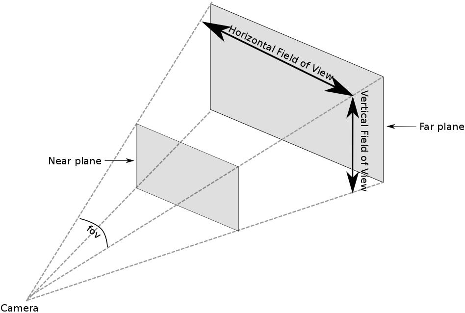
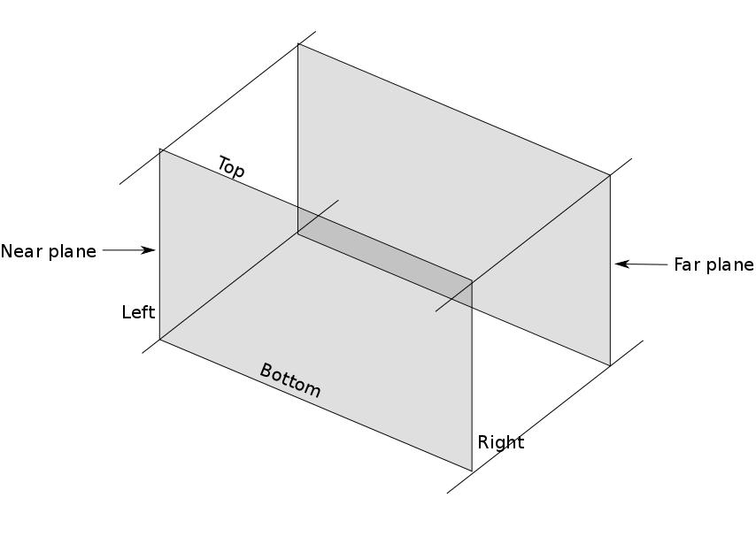
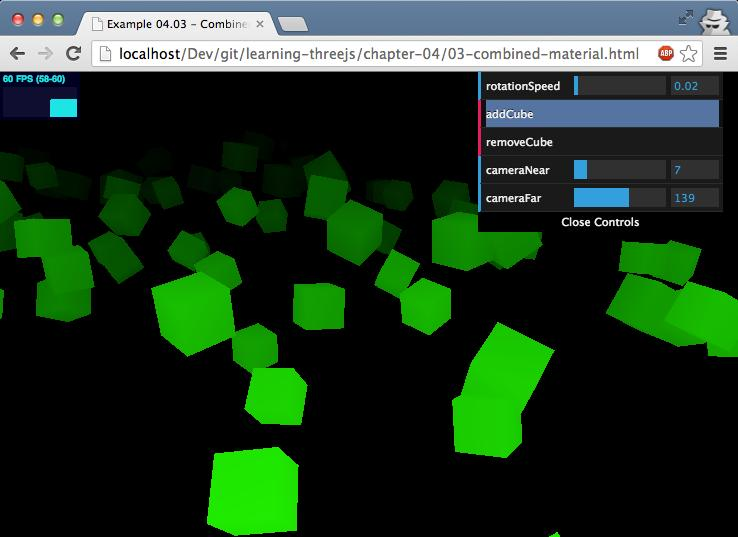
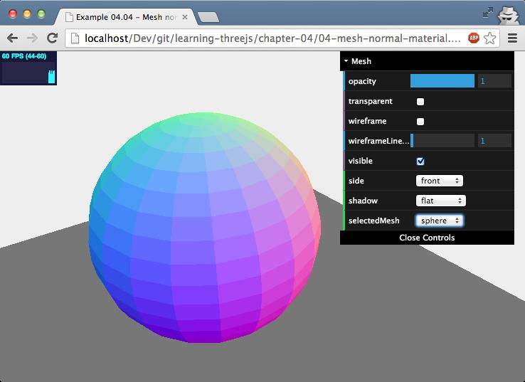
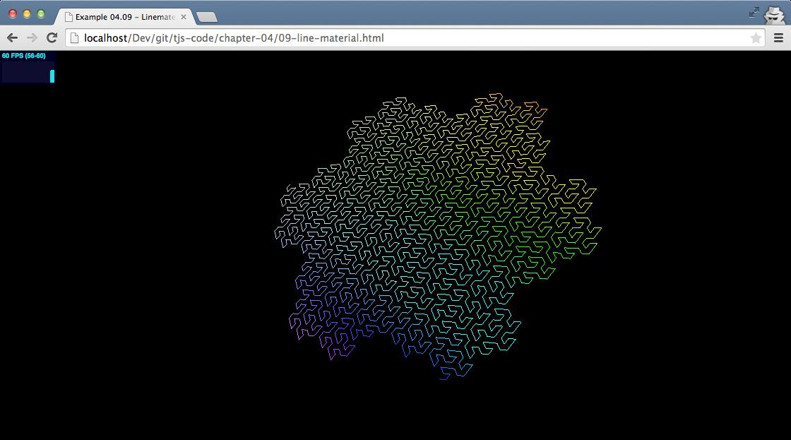
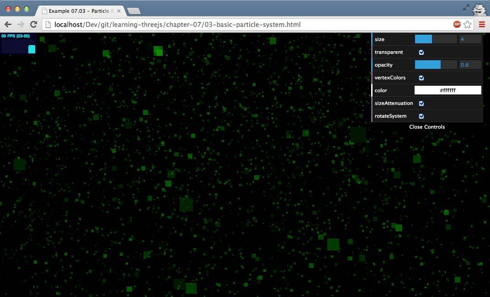

book: learning-three-js-the-javascript-3d-library-for-webgl  
use python server: $python -m SimpleHTTPServer  
clone examples:  git clone https://github.com/josdirksen/learning-threejs  

```
  function render() {
   stats.update();
    scene.traverse(function(obj) {
    if (obj instanceof THREE.Mesh && obj != plane ) {
      obj.rotation.x+=controls.rotationSpeed;
      obj.rotation.y+=controls.rotationSpeed;
      obj.rotation.z+=controls.rotationSpeed;
    }
    });
    requestAnimationFrame(render);
    renderer.render(scene, camera);
  }
```
 
Here, we see the THREE.Scene.traverse() function being used. We can pass a function to the traverse() function that will be called for each child of the scene. If a child itself has children, remember that a THREE.Scene object can contain a tree of objects. The traverse() function will also be called for all the children of that object. You traverse through the complete scene graph    

add(object)                                                 
  This is used to add an object to the scene. You can also use this function, as we will see later on, to create groups of objects.
  
children                                                      
  This returns a list of all the objects that have been added to the scene, including the camera and lights.  

getObjectByName(name,recursive)   
  When you create an object, you can give it a distinct name. The scene object has a function that you can use to directly return an object with a specific name. If you set the recursive argument to true, Three.js will also search through the complete tree of objects to find the object with the specified name.    

remove(object)  
  If you have a reference to an object in the scene, you can also remove it from the scene using this function.  

traverse(function)   
  The children property returns a list of all the children in the scene. With the traverse function, we can also access these children. With traverse, all the children are passed in to the supplied function one by one. fog This property allows you to set the fog for the scene. The fog will render a haze that hides faraway objects.  

overrideMaterial   
  With this property, you can force all the objects in the scene to use the same material.  


-- 
### Some properties ans function for a Geometry
05-custom-geometry , you can see a clone button at the top of the control GUI
Three.js, of course, supports using multiple materials when creating a mesh. You can use the SceneUtils.createMultiMaterialObject function for this, as shown in the following code:
```
var materials = [
new THREE.MeshLambertMaterial( { opacity:0.6, color: 0x44ff44, transparent:true } ),
new THREE.MeshBasicMaterial( { color: 0x000000, wireframe: true } )
];
var mesh = THREE.SceneUtils.createMultiMaterialObject( geom,
materials);
```
What Three.js does in this function is that it doesn't create one THREE.Mesh object, but it creates one for each material you specified and puts these meshes in a group (a THREE.Object3D object). This group can be used in the same manner as you've used the scene object. You can add meshes, get objects by name, and so on. For instance, to make sure all the children of the group cast shadows, you do the following:  
```
 mesh.children.forEach(function(e) {e.castShadow=true});
```
Three.js also provides an alternative way of adding a wireframe using THREE.WireFrameHelper. To use this helper, first instantiate the helper like this:    
```
var helper = new THREE.WireframeHelper(mesh, 0x000000);  
```
You provide the mesh you want to show the wireframe for and the color  of the wireframe. Three.js will now create a helper object that you can  add to the scene, **scene.add(helper)**.  


### Some functions and attributes from mesh
Position   
  This determines the position of this object relative to the  position of its parent. Most often, the parent of an object is a THREE.Scene object or a THREE.Object3D object.  
rotation  
  With this property, you can set the rotation of an object around any of its axes. Three.js also provides specific functions for rotations around an axis: rotateX(), rotateY(), and rotateZ()   
scale  
  This property allows you to scale the object around its x, y, and z axes.  
translateX(amount)  
  This property moves the object the specified amount over the x axis. The same for y and z axis.  

For the translate functions, you could also use the translateOnAxis(axis, distance) function, which allows you to translate the mesh a distance along a specific axis.    

visible
  If you set this property to false, THREE.Mesh wont be rendered by Three.js. 
Chapter 2, example 06-mesh-properties.html

### Orthographic and perspective cameras

Example of switch function
```
this.switchCamera = function() {
if (camera instanceof THREE.PerspectiveCamera) {
camera = new THREE.OrthographicCamera( window.innerWidth / -
16, window.innerWidth / 16, window.innerHeight / 16,
window.innerHeight / - 16, -200, 500 );
camera.position.x = 120;
camera.position.y = 60;
camera.position.z = 180;
camera.lookAt(scene.position);
this.perspective = "Orthographic";
} else {
camera = new THREE.PerspectiveCamera(45, window.innerWidth /
window.innerHeight, 0.1, 1000);
camera.position.x = 120;
camera.position.y = 60;
camera.position.z = 180;
camera.lookAt(scene.position);
this.perspective = "Perspective";
}
};
```

####THREE.PerspectiveCamera:
**FOV**    
  stands for Field Of View. This is the part of the scene that can be seen from the position of the camera. Humans, for instance, have an almost 180-degree FOV, while some birds might even have a complete 360-degree FOV. But since a normal computer screen doesnt completely fill our vision, normally a smaller value is chosen. Most often, for games, a FOV between 60 and 90 degrees is chosen.  
  Good default: 50  
**Aspect**  
  This is the aspect ratio between the horizontal and vertical sizes of the area where we are to render the output. In our case, since we use the entire window, we just use that ratio. The aspect ratio determines the difference between the horizontal FOV and the vertical FOV, as you can see in the following image.   
Good default: window.innerWidth / window.innerHeight  
**near**  
  The near property defines from how close to the camera Three.js should render the scene. Normally, we set this to a very small value to directly render everything from the position of the camera. Good default: 0.1  
**far**  
  The far property defines how far the camera can see from the position of the camera. If we set this too low, a part of our scene might not be rendered, and if we set it too high, in some cases, it might affect the rendering performance. Good default: 1000  
**zoom**  
  The zoom property allows you to zoom in and out of the scene. When you use a number lower than 1, you zoom out of the scene, and if you use a number higher than 1, you zoom in. Note that if you specify a negative value, the scene will be rendered upside down. Good default value: 1
 
   

####THREE.OrthographicCamera:
**left**  
  This is described in the Three.js documentation as Camera frustum left plane. You should see this as what is the left-hand border of what will be rendered. If you set this value to -100, you wont see any objects that are farther to the left-hand side.   
**right**  
  The right property works in a way similar to the left property, but this time, to the other side of the screen. Anything farther to the right wont be rendered.  
**top**  
  This is the top position to be rendered.  
**bottom**   
  This is the bottom position to be rendered.  
**near**   
  From this point, based on the position of the camera, the scene will be rendered.    
**far**   
  To this point, based on the position of the camera, the scene will be rendered.    
**zoom**    
  This allows you to zoom in and out of the scene. When you use a number lower than 1, you'll zoom out of the scene; if you use a number higher than 1, you'll zoom in. Note that if you specify a negative value, the scene will be rendered upside down. The default value is 1.   

   

When you use the **lookAt** function, you point the camera at a specific position. You can also use this to make the camera follow an object around the scene. Since every **THREE.Mesh** object has a position that is a **THREE.Vector3** object, you can use the lookAt function to point to a specific mesh in the scene. All you need to do is this: **camera.lookAt(mesh.position)**. If you call this in the render loop, you will make the camera follow an object as it moves through the scene. 

### Materials  

**MeshBasicMaterial**  
  This is a basic material that you can use to give your geometries a simple color or show the wireframe of your geometries   
**MeshDepthMaterial**  
  This is a material that uses the distance from the camera to determine how to color your mesh.   
**MeshNormalMaterial**  
  This is a simple material that bases the color of a face on its normal vector.  
**MeshFaceMaterial**  
  This is a container that allows you to specify a unique material for each face of the geometry.  
**MeshLambertMaterial**  
  This is a material that takes lighting into account and is used to create dull non-shiny-looking objects    
**MeshPongMaterial**  
  This is a material that also takes lighting into account and can be used to create shiny objects.  
**ShaderMaterial**  
  This material allows you to specify your own shader programs to directly control how vertices are positioned and pixels are colored.  
**LineBasicMaterial**  
  This is a material that can be used on the THREE.Line geometry to create colored lines.   
**LineDashMaterial**  
  This is the same as LineBasicMaterial, but this material also allows you to create a dashed effect.   

#### Common material properties
- **Basic properties**: These are the properties you will use most often. With these properties, you can, for instance, control the opacity of the object, whether it is visible, and how it is referenced (by ID or custom name).   

- **Blending properties**: Every object has a set of blending properties. These properties define how the object is combined with its background.     
- **Advanced properties**: There are a number of advanced properties that control how the low-level WebGL context renders objects. In most cases, you wont need to mess with these properties.  

##### Basic Properties
**id** This is used to identify a material and is assigned when you create a material. This starts at 0 for the first material and is increased by 1 for each additional material that is created.   
**uuid** This is a uniquely generated ID and is used internally.  
**name** You can assign a name to a material with this property. This can be used for debugging purposes.   
**opacity** This defines how transparent an object is. Use this together with the transparent property. The range of this property is from 0 to 1.    
**transparent** If this is set to true, Three.js will render this object with the set opacity. If this is set to false, the object wont be transparent—just more lightly colored. This property should also be set to true if you use a texture that uses an alpha (transparency) channel.     
**overdraw**  When you use THREE.CanvasRenderer, the polygons will be rendered a bit bigger. Set this to true when you see gaps when using this renderer.  
**visible**  This defines whether this material is visible. If you set this to false, you wont see the object in the scene.   
**Side**  With this property, you can define to which side of the geometry a material is applied. The default is THREE.Frontside, which applies the material to the front (outside) of an object. You can also set this to THREE.BackSide, which applies is to the back (inside), or THREE.DoubleSide, which applies it to both sides.  
**needsUpdate**  For some updates to the material, you need to tell Three.js that the material has been changed. If this property is set to true, Three.js will update its cache with the new material properties.  

##### Blending properties
**blending** This determines how the material on this object blends with the background. The normal mode is THREE.NormalBlending, which only shows the top layer.                                         
**blendsrc** Besides using the standard blending modes, you can also create custom blend modes by setting blendsrc, blenddst, and blendequation. This property defines how this object (the source) is blended into the background (the destination). The default THREE.SrcAlphaFactor setting uses the alpha (transparency) channel for blending.  
**blenddst**  This property defines how the background (the destination) is used in blending and defaults to THREE.OneMinusSrcAlphaFactor, which means this property too uses the alpha channel of the source for blending but uses 1 (alpha channel of the source) as the value.  
**blendequation**  This defines how the blendsrc and blenddst values are used. The default is to add them (AddEquation). With these three properties, you can create your own custom blend modes.   

#### THREE.MeshBasicMaterial  

**Color** This property allows you to set the color of the material.  
**wireframe** This allows you to render the material as a wireframe. This is great for debugging purposes.  
**Wireframelinewidth** If you enable the wireframe, this property defines the width of the wires from the wireframe.   
**Wireframelinecap** This property defines how the ends of lines look in wireframe mode. The possible values are butt, round, and square. The default value is round. In practice, the results from changing this property are very difficult to see. This property isn't supported on WebGLRenderer   
**wireframeLinejoin** This defines how the line joints are visualized. The possible values are round, bevel, and miter. The default value is round. If you look very closely, you can see this in the example using low opacity and a very large wireframeLinewidth value. This property isn't supported on WebGLRenderer.  
**Shading** This defines how shading is applied. The possible values are THREE.SmoothShading, THREE.NoShading, and THREE. FlatShading. The default value is THREE.SmoothShading, which results in a smooth object where you won't see the individual faces. This property isn't enabled in the example for this material. For an example, look at the section on MeshNormalMaterial.  
**vertexColors**  You can define individual colors to be applied to each vertex with this property. The default value is THREE.NoColors. If you set this value to THREE.VertexColors, the renderer will take the colors set on the colors property of THREE. Geometry into account. 
This property doesnt work on CanvasRenderer but does work on WebGLRenderer. Look at the LineBasicMaterial example, where we use this property to color the various parts of a line. You can also use this property to create a gradient effect for this material type.   
**fog** This property determines whether this material is affected by global fog settings. This is not shown in action, but if this is set to false, the global fog we saw in Chapter 2, Basic Components That Make Up a Three.js Scene, doesnt affect how this object is rendered.  

#### THREE.MeshDepthMaterial

**wireframe** This determines whether or not to show the wireframe.  
**wireframeLineWidth** This determines the width of the wireframe.  

#### Combining materials
```
var cubeMaterial = new THREE.MeshDepthMaterial();
var colorMaterial = new THREE.MeshBasicMaterial({color: 0x00ff00,
transparent: true, blending: THREE.MultiplyBlending})
var cube = new THREE.SceneUtils.createMultiMaterialObject
(cubeGeometry, [colorMaterial, cubeMaterial]);
cube.children[1].scale.set(0.99, 0.99, 0.99);
```
   

#### THREE.MeshNormalMaterial

   

#### THREE.LineBasicMaterial

**color** This determines the color of the line. If you specify vertexColors, this property is ignored.  
**linewidth** Materials you can use for a line geometry  
**linecap** This property defines how the ends of lines look in the wireframe mode. The possible values are butt, round, and square. The default is round. In practice, the results from changing this property are very difficult to see. This property isnt supported on WebGLRenderer.   
**linejoin**  Define how the line joints are visualized. The possible values are round, bevel, and miter. The default value is round. If you look very closely, you can see this in the example using low opacity and a very large wireframeLinewidth. This property isnt supported on WebGLRenderer.   
**vertexColors**  You can supply a specific color for each vertex by setting this property to the THREE.VertexColors value.   
**fog**  This determines whether this object is affected by the global fog property.  

An example of a THREE.LineMesh from a set of vertices:  
```
var points = gosper(4, 60);
var lines = new THREE.Geometry();
var colors = [];
var i = 0;
points.forEach(function (e) {
  lines.vertices.push(new THREE.Vector3(e.x, e.z, e.y));
  colors[ i ] = new THREE.Color(0xffffff);
  colors[ i ].setHSL(e.x / 100 + 0.5, ( e.y * 20 ) / 300, 0.8);
  i++;
});
lines.colors = colors;
var material = new THREE.LineBasicMaterial({
  opacity: 1.0,
  linewidth: 1,
  vertexColors: THREE.VertexColors });
var line = new THREE.Line(lines, material);
```
The first part of this code fragment, var points = gosper(4, 60); , is used as an example to get a set of x and y coordinates. This function returns a gosper curve (for more information, check out http://en.wikipedia.org/wiki/Gosper_curve ), which is a simple algorithm that fills a 2D space.   
What we do next is we create a THREE.Geometry instance, and for each coordinate, we create a new vertex, which we push into the lines property of this instance. For each coordinate, we also calculate a color value that we use to set the colors property.   

   

#### THREE.LineDashedMaterial
This material has the same properties as THREE.LineBasicMaterial and two additional ones you can use to define the dash width and the width of the gaps between the dashes, which are as follows:   

**scale** This scales dashSize and gapSize. If the scale is smaller than 1, dashSize and gapSize increase, and if the scale is larger than 1, dashSize and gapSize decrease.   
**dashSize** This is the size of the dash.  
**gapSize** This is the size of the gap.  

A snippet example how to use: 
```  
lines.computeLineDistances();
var material = new THREE.LineDashedMaterial({ vertexColors: true,
  color: 0xffffff, dashSize: 10, gapSize: 1, scale: 0.1 });
```
The only difference is that you have to call **computeLineDistances()** (which is used to determine the distance between the vertices that make up a line). If you don't do this, the gaps won't be shown correctly.   

### Particles, THREE.Points, and THREE.PointsMaterial
(chapter 7)
Tha name for this particle system was changing from THREE.ParticleSystem →  THREE.PointCloud → THREE.Points

In this example, we create THREE.PointCloud , which we fill with 15,000 particles. All the particles are styled with THREE.PointCloudMaterial . To create THREE. PointCloud , we used the following code:    

   

```
function createParticles(size, transparent, opacity, vertexColors,
sizeAttenuation, color) {
  var geom = new THREE.Geometry();
  var material = new THREE.PointsMaterial({size: size,
    transparent: transparent, opacity: opacity, vertexColors:
    vertexColors, sizeAttenuation: sizeAttenuation, color:
    color});
  var range = 500;
  for (var i = 0; i < 15000; i++) {
    var particle = new THREE.Vector3(Math.random() * range - range/ 2, 
      Math.random() * range - range / 2, 
      Math.random() * range - range / 2);
    geom.vertices.push(particle);
    var color = new THREE.Color(0x00ff00);
    color.setHSL(color.getHSL().h, color.getHSL().s, Math.random() * color.getHSL().l);
    geom.colors.push(color);
  }
  cloud = new THREE.Points(geom, material);
  scene.add(cloud);
}
```
**color** This is the color of all the particles in ParticleSystem. Setting the vertexColors property to true and specifying the colors using the colors property of the geometry overrides this property (to be more precise, the color of a vertex will be multiplied with this value to determine the final color). The default value is 0xFFFFFF.   
**map** With this property, you can apply a texture to the particles. You can, for instance, make them look like snowflakes. This property isnt shown in this example but is explained later on in this chapter.    
**size** This is the size of the particle. The default value is 1.  
**sizeAnnuation**  If this is set to false, all the particles will have the same size regardless of how far from the camera they are positioned. If this is set to true, the size is based on the distance from the camera. The default value is true.  
**vertexColors** Normally, all the particles in THREE.Points have the same color. If this property is set to THREE.VertexColors and the colors array in the geometry has been filled, the colors from that array will be used instead (also see the color entry in this table). The default value is THREE.NoColors.   
**opacity**  This, together with the transparent property, sets the opacity of the particle. The default value is 1 (no opacity).    
**transparent** If this is set to true, the particle will be rendered with the opacity set by the opacity property. The default value is false.   
**blending**  This is the blend mode to use when rendering the particle. See Chapter 9, Animations and Moving the Camera, for more information on blend modes.  
**fog** This determines whether the particles are affected by fog added to the scene. This defaults to true.   

Others ways to style the particles:  
- We can apply THREE.SpriteCanvasMaterial (which only works for THREE. CanvasRenderer ) to use the results from an HTML canvas element as a texture.    

- Use **THREE.SpriteMaterial** and a HTML5-based texture to use the output of an HTML canvas when working with THREE.WebGLRenderer.    

- Load an external image file (or use the HTML5 canvas) with the map property of THREE.PointsMaterial to style all particles of THREE.Points     


#### Using HTML5 canvas with WebGLRenderer 

Two approach for this:  
- **A** We can use THREE.PointsMaterial and create THREE.Points.   
- **B** We can use THREE.Sprite and the map property of THREE.SpriteMaterial.  

##### A. THREE.PointsMaterial and create THREE.Points.   
```
var getTexture = function() {
  var canvas = document.createElement('canvas');
  canvas.width = 32;
  canvas.height = 32;
  var ctx = canvas.getContext('2d');
  ...
  // draw wherever you want to see as a particle  
  ...
  ctx.fill();
  var texture = new THREE.Texture(canvas);
  texture.needsUpdate = true;
  return texture;
}
function createPointCloud(size, transparent, opacity, sizeAttenuation, color) {
  var geom = new THREE.Geometry();
  var material = new THREE.PointsMaterial ({size: size,
  transparent: transparent, opacity: opacity, map: getTexture(),
  sizeAttenuation: sizeAttenuation, color: color});
  var range = 500;
  for (var i = 0; i < 5000; i++) {
    var particle = new THREE.Vector3(Math.random() * range -
    range / 2, Math.random() * range - range / 2,
    Math.random() * range - range / 2);
    geom.vertices.push(particle);
  }
  cloud = new THREE.Points(geom, material);
  cloud.sortParticles = true;
  scene.add(cloud);
  }
```

**cloud.sortParticles = true;**  This property makes sure that before the particles are rendered, they are sorted according to their z position on screen. ** For a THREE.Points object that is very large, this can have a big impact on performance.**   

While we're talking about the properties of THREE.Points, there is one additional property you can set on THREE.Points:   
**FrustumCulled** If this property is set to **true**, it means that if particles fall outside the visible camera range, they aren't rendered. This can be used to improve performance and frame rate if needed.   

##### B. THREE.Sprite and the map property of THREE.SpriteMaterial.   
Using the getTexture() function declared above. 

```
function createSprites() {
var material = new THREE.SpriteMaterial({
map: getTexture(),
color: 0xffffff
});
var range = 500;
for (var i = 0; i < 1500; i++) {
var sprite = new THREE.Sprite(material);
sprite.position.set(Math.random() * range - range / 2,
Math.random() * range - range / 2, Math.random() * range -
range / 2);
sprite.scale.set(4,4,4);
scene.add(sprite);
}
}
```
- With THREE.Sprite , you have more control over the individual particle, but it becomes less performant and more complex when you are working with a large number of particles.  
- With THREE.Points , you can easily manage a large number of particles, but have less control over each individual particle.  


