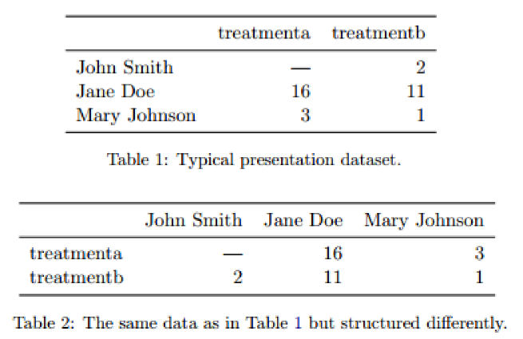
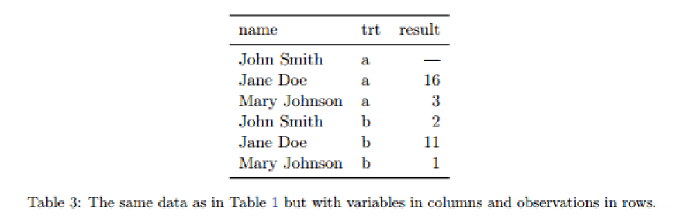
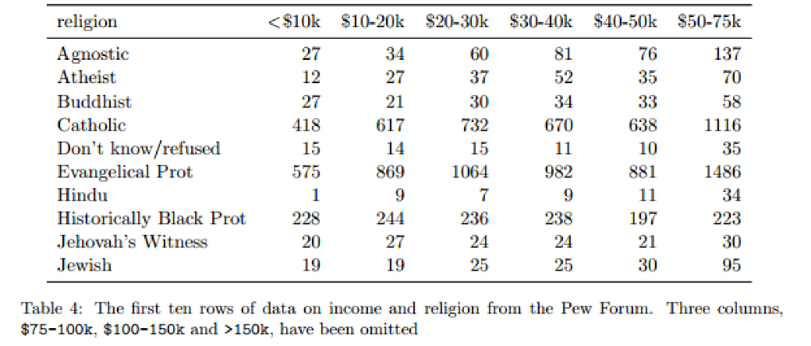

from: Journal of Statistical Software
http://vita.had.co.nz/papers/tidy-data.pdf

## 2. Defining tidy data 
Tidy datasets are all alike but every messy dataset is messy in its own way 
Tidy datasets provide a standardized way to link the structure of a dataset (its physical layout) with its semantics (its meaning)  

### 2.1 Data structure
Most statistical datasets are rectangular tables made up of rows and columns. The columns are almost always labelled and the rows are sometimes labelled.

In addition to appearance, we need a way to describe the underlying semantics, or meaning, of the values displayed in table

### 2.2 Data semantics
A dataset is a collection of values, usually either numbers (if quantitative) or strings (if qualitative).  
Values are organised in two ways. Every value belongs to a **variable** AND an **observation**. 

#### A variable
contains all values that measure the same underlying attribute (like height, temperature, duration) across units.  

#### An observation
contains all values measured on the same unit (like a person, or a day, or a race) across attribute.  

Table 3 reorganises Table 1 to make the values, variables and obserations more clear. The dataset contains:  
> 18 values representing:
>> 3 variables and 6 observations.

  

The variables are:
- person, with three possible values (John, Mary, and Jane). 
- treatment, with two possible values (a and b).  
- result, with five or six values depending on how you think of the missing value (-, 16, 3, 2, 11, 1).  

**About missing values:** In this experiment, the missing value represents an observation that should have been made, but wasn’t, so it’s important to keep it. Structural missing values, which represent measurements that can’t be made (e.g., the count of pregnant males) can be safely removed. 

A general rule of thumb is that it is easier to describe functional relationships between variables than between rows,
> (e.g., z is a linear combination of x and y, density is the ratio of weight to volume)  
and it is easier to make comparisons between groups of observations than between groups of columns. 
> (e.g., average of group a vs. average of group b)  

In a given analysis, there may be multiple levels of observation. For example, in a trial of new allergy medication we might have three observational types: 
> demographic data collected from each person (age, sex, race) 
> medical data collected from each person on each day (number of sneezes, redness of eyes)  
> and meterological data collected on each day (temperature, pollen count).  

### 2.3 Tidy data
A standard way of mapping the meaning of a dataset to its structure  

A dataset is messy or tidy depending on how rows, columns and tables are matched up with observations, variables and types. 
- Each **variable** forms a **column**  
- Each **observation** forms a **row**
- Each **type of observational unit** forms a **table**  

Table 3 is the tidy version of Table 1. Each row represents an observation, the result of one treatment on one person, and each column is a variable.

  

Tidy data is particularly well suited for vectorised programming languages like R, because the layout ensures that values of different variables from the same observation are always paired. 

One way of organising variables is by their role in the analysis: 
> are values **fixed** by the design of the data collection,  
> or are they **measured** during the course of the experiment?.  

Fixed variables should come first, followed by measured variables, each ordered so that related variables are contiguous. Rows can then be ordered by the first variable, breaking ties with the second and subsequent (fixed) variables. This is the convention adopted by all tabular displays in this paper.  

## 3. Tidying messy datasets 

Five most common problems with messy datasets:  
- Column headers are values, not variable names.  
- Multiple variables are stored in one column.  
- Variables are stored in both rows and columns.  
- Multiple types of observational units are stored in the same table.  
- A single observational unit is stored in multiple table  

Surprisingly, most messy datasets, including types of messiness not explicitly described above, can be tidied with a small set of tools: melting, string splitting, and casting.

### 3.1 Column headers are values, not variable names. 

This dataset explores the relationship between income and religion in the US. 

  

This dataset has three variables, religion, income and frequency. To tidy it, we need to melt, or stack it. In other words, we need to turn columns into rows.

